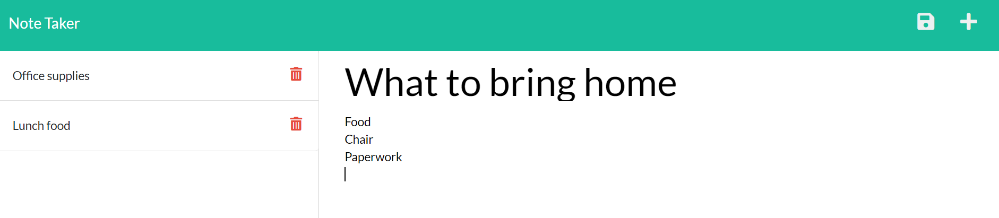

# Business-Owner-Note-Taker
- Link to Business-Owner-Note-Taker Github [github](https://github.com/anhcu/Business-Owner-Note-Taker)
- Link to [Heroku](#)

# Table of Contents
* [License](#License)
* [Description](#Description)
* [Criteria](#Criteria)
* [Contact](#Contact)
* [Mock](#Mock)

# License

# Description

As a business owner, I like to stay on track and remind myself of all the tasks I have to accomplish in one day. Note taker is an application for business owners who multitask, but want to stay organized.  This application allows users to type in their notes and save it to this application.  You can delete the note once your task is completed 

# Install 

* Install [NPM UUID](https://www.npmjs.com/package/uuid)
* Install [NPM Express](https://www.npmjs.com/package/express)
# Criteria

- [x] GIVEN a note-taking application
- [x] WHEN I open the Note Taker
- [x] THEN I am presented with a landing page with a link to a notes page
- [x] WHEN I click on the link to the notes page
- [x] THEN I am presented with a page with existing notes listed in the left-hand column, plus empty fields to enter a new note title and the note’s text in the right-hand column
- [x] WHEN I enter a new note title and the note’s text
- [x] THEN a Save icon appears in the navigation at the top of the page
- [x] WHEN I click on the Save icon
- [x] THEN the new note I have entered is saved and appears in the left-hand column with the other existing notes
- [x] WHEN I click on an existing note in the list in the left-hand column
- [x] THEN that note appears in the right-hand column
- [x] WHEN I click on the Write icon in the navigation at the top of the page
- [x] THEN I am presented with empty fields to enter a new note title and the note’s text in the right-hand column

# Contact
  If you have any question or would like to reach out plase [email](mailto:anhcu714@gmail.com).

# Mock
